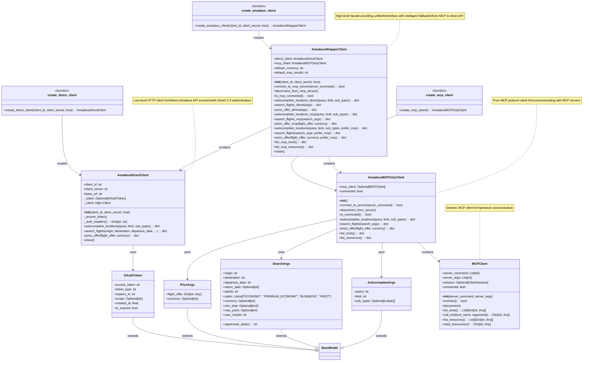

# Amadeus MCP Client Package - Refactored Class Diagram

## Overview

The Amadeus MCP client package has been refactored into three separate components for better separation of concerns:



## Refactored Package Structure

```
mcp_clients/amadeus/
├── __init__.py                # Main exports and backward compatibility
├── direct_client.py          # Direct Amadeus API client
│   ├── OAuthToken (Pydantic model)
│   ├── AmadeusDirectClient
│   └── create_direct_client() (Factory function)
├── mcp_client.py             # MCP-specific functionality
│   ├── AutocompleteArgs (Pydantic model)
│   ├── SearchArgs (Pydantic model)
│   ├── PriceArgs (Pydantic model)
│   ├── AmadeusMCPOnlyClient
│   └── create_mcp_client() (Factory function)
├── wrapper_client.py         # High-level wrapper with fallback
│   ├── AmadeusWrapperClient
│   └── create_amadeus_client() (Factory function)
└── client.py.backup          # Original monolithic implementation
```

## Key Design Patterns

1. **Facade Pattern**: `AmadeusWrapperClient` provides unified interface for both access methods
2. **Strategy Pattern**: Intelligent fallback from MCP to direct API based on availability
3. **Factory Pattern**: Multiple factory functions for different client types
4. **Composition**: `AmadeusWrapperClient` composes `AmadeusDirectClient` and `AmadeusMCPOnlyClient`
5. **Single Responsibility**: Each class has one clear purpose
6. **Separation of Concerns**: Direct API, MCP protocol, and wrapper logic are separated

## Component Responsibilities

### AmadeusDirectClient
- OAuth 2.0 token management
- Direct HTTP calls to Amadeus API
- Raw API response handling
- Connection management

### AmadeusMCPOnlyClient  
- MCP server connection management
- MCP tool calls and responses
- Protocol-specific operations
- Server status monitoring

### AmadeusWrapperClient
- Unified interface for both access methods
- Intelligent fallback logic
- Response normalization
- Configuration management

## Usage Patterns

### Direct API Only
```python
from source.mcp_clients.amadeus import create_direct_client
client = create_direct_client()
result = client.autocomplete_locations("Paris")
client.close()
```

### MCP Protocol Only
```python
from source.mcp_clients.amadeus import create_mcp_client
client = create_mcp_client()
await client.connect_to_server(server_command)
result = await client.autocomplete_locations("Paris")
await client.disconnect_from_server()
```

### Comprehensive (Recommended)
```python
from source.mcp_clients.amadeus import create_amadeus_client
client = create_amadeus_client()
# Use direct API methods
result = client.autocomplete_locations_direct("Paris")
# Or use fallback methods (tries MCP first, falls back to direct)
result = await client.autocomplete_locations("Paris", prefer_mcp=True)
client.close()
```

## Dependencies

### Direct Client
- **External**: `httpx`, `pydantic`, `dotenv`
- **Internal**: None (standalone)

### MCP Client
- **External**: `pydantic`
- **Internal**: `mcp_clients.client.MCPClient`
- **MCP**: `mcp.ClientSession`, `mcp.client.stdio`

### Wrapper Client
- **External**: `dotenv`
- **Internal**: `AmadeusDirectClient`, `AmadeusMCPOnlyClient`

## Backward Compatibility

The refactoring maintains full backward compatibility through aliases:
- `AmadeusMCPClient` → `AmadeusWrapperClient`
- `AmadeusAPIClient` → `AmadeusDirectClient` 
- `create_amadeus_client()` continues to work as expected