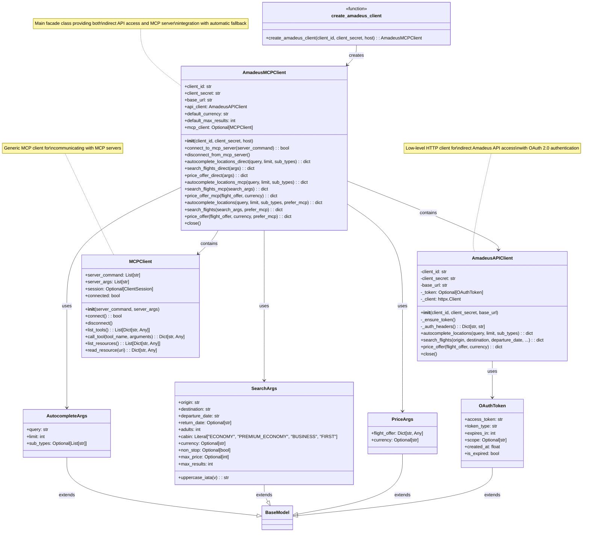

# Amadeus MCP Client Package - Class Diagram



## Package Structure

```
mcp_clients/amadeus/
├── __init__.py
└── client.py
    ├── OAuthToken (Pydantic model)
    ├── AmadeusAPIClient (Low-level API client)
    ├── AutocompleteArgs (Pydantic model)
    ├── SearchArgs (Pydantic model)
    ├── PriceArgs (Pydantic model)
    ├── AmadeusMCPClient (High-level facade)
    └── create_amadeus_client() (Factory function)
```

## Key Design Patterns

1. **Facade Pattern**: `AmadeusMCPClient` provides a unified interface for both direct API and MCP server access
2. **Strategy Pattern**: Automatic fallback from MCP to direct API based on availability
3. **Factory Pattern**: `create_amadeus_client()` function for easy instantiation
4. **Composition**: `AmadeusMCPClient` contains both `AmadeusAPIClient` and `MCPClient`

## Usage Flow

1. Create client using factory function
2. Optionally connect to MCP server
3. Use convenience methods with automatic fallback
4. Direct API methods always available as backup
5. Close connections when done

## Dependencies

- **External**: `httpx`, `pydantic`, `dotenv`
- **Internal**: `mcp_clients.client.MCPClient`
- **MCP**: `mcp.ClientSession`, `mcp.client.stdio`