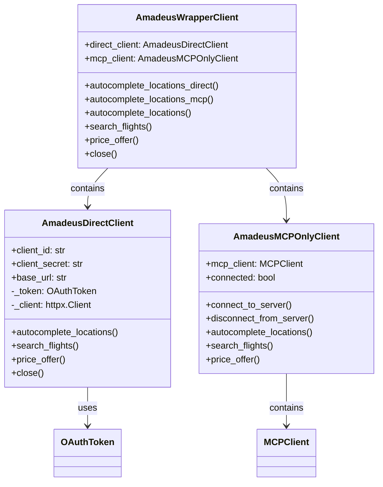

# Amadeus MCP Client - Refactored Architecture

## Overview

The Amadeus MCP client has been refactored into three separate files for better separation of concerns, maintainability, and modularity:

## File Structure

```
source/mcp_clients/amadeus/
├── __init__.py                 # Main exports and backward compatibility
├── direct_client.py           # Direct Amadeus API client
├── mcp_client.py              # MCP-specific functionality  
├── wrapper_client.py          # High-level wrapper with fallback logic
└── client.py.backup           # Original monolithic implementation (backup)
```

## Components

### 1. Direct Client (`direct_client.py`)

**Purpose**: Low-level direct API access to Amadeus services

**Class**: `AmadeusDirectClient`

**Responsibilities**:
- OAuth 2.0 token management
- Direct HTTP calls to Amadeus API endpoints
- Raw API response handling
- Connection management

**Usage**:
```python
from source.mcp_clients.amadeus import create_direct_client

client = create_direct_client()
result = client.autocomplete_locations("Paris")
client.close()
```

### 2. MCP Client (`mcp_client.py`)

**Purpose**: MCP server communication and protocol handling

**Class**: `AmadeusMCPOnlyClient`

**Responsibilities**:
- MCP server connection management
- MCP tool calls and responses
- Pydantic schema validation for MCP operations
- Server status monitoring

**Usage**:
```python
from source.mcp_clients.amadeus import create_mcp_client

client = create_mcp_client()
await client.connect_to_server(["python", "-m", "source.mcp_servers.amadeus.server"])
result = await client.autocomplete_locations("Paris")
await client.disconnect_from_server()
```

### 3. Wrapper Client (`wrapper_client.py`)

**Purpose**: High-level interface combining both direct API and MCP functionality

**Class**: `AmadeusWrapperClient`

**Responsibilities**:
- Unified interface for both access methods
- Intelligent fallback from MCP to direct API
- Configuration management
- Response normalization

**Usage**:
```python
from source.mcp_clients.amadeus import create_amadeus_client

client = create_amadeus_client()

# Direct API access
result = client.autocomplete_locations_direct("Paris")

# MCP server access (if connected)
await client.connect_to_mcp_server(server_command)
result = await client.autocomplete_locations_mcp("Paris")

# Smart fallback (tries MCP first, falls back to direct API)
result = await client.autocomplete_locations("Paris", prefer_mcp=True)

client.close()
```

## Backward Compatibility

The refactoring maintains full backward compatibility:

```python
# Original usage still works
from source.mcp_clients.amadeus import create_amadeus_client, AmadeusMCPClient

client = create_amadeus_client()  # Returns AmadeusWrapperClient
# All original methods continue to work unchanged
```

## Benefits of Refactoring

### 1. **Separation of Concerns**
- Direct API logic isolated from MCP protocol handling
- Each component has single responsibility
- Easier testing and debugging

### 2. **Modularity**
- Components can be used independently
- Easier to extend or modify specific functionality
- Reduced coupling between different access methods

### 3. **Maintainability**
- Smaller, focused files are easier to understand
- Changes to one access method don't affect others
- Clear boundaries between different responsibilities

### 4. **Flexibility**
- Choose appropriate client for specific use cases
- Direct client for simple API access
- MCP client for protocol-specific operations
- Wrapper client for comprehensive functionality

### 5. **Testability**
- Individual components can be unit tested in isolation
- Mock dependencies more easily
- Better test coverage and reliability

## Import Structure

```python
# Individual components
from source.mcp_clients.amadeus import AmadeusDirectClient, create_direct_client
from source.mcp_clients.amadeus import AmadeusMCPOnlyClient, create_mcp_client  
from source.mcp_clients.amadeus import AmadeusWrapperClient, create_amadeus_client

# Backward compatibility aliases
from source.mcp_clients.amadeus import AmadeusMCPClient  # = AmadeusWrapperClient
from source.mcp_clients.amadeus import AmadeusAPIClient  # = AmadeusDirectClient
```

## Design Patterns Used

1. **Factory Pattern**: Factory functions for clean object creation
2. **Facade Pattern**: Wrapper client provides unified interface
3. **Strategy Pattern**: Fallback strategy from MCP to direct API
4. **Composition**: Wrapper client composes direct and MCP clients
5. **Single Responsibility**: Each class has one clear purpose

## Migration Guide

### For Direct API Users
```python
# Before (using old client)
from source.mcp_clients.amadeus.client import AmadeusAPIClient
client = AmadeusAPIClient(id, secret, url)

# After (using new structure)
from source.mcp_clients.amadeus import create_direct_client
client = create_direct_client(id, secret, host)
```

### For MCP Users  
```python
# Before (mixed in main client)
client = AmadeusMCPClient()
await client.connect_to_mcp_server(cmd)

# After (dedicated MCP client)
from source.mcp_clients.amadeus import create_mcp_client
client = create_mcp_client()
await client.connect_to_server(cmd)
```

### For Comprehensive Users
```python
# Before and After (no change needed)
from source.mcp_clients.amadeus import create_amadeus_client
client = create_amadeus_client()
# All existing methods work unchanged
```

## Updated Architecture Diagram



This refactored architecture provides a clean, maintainable, and flexible foundation for Amadeus API integration with both direct and MCP access patterns.