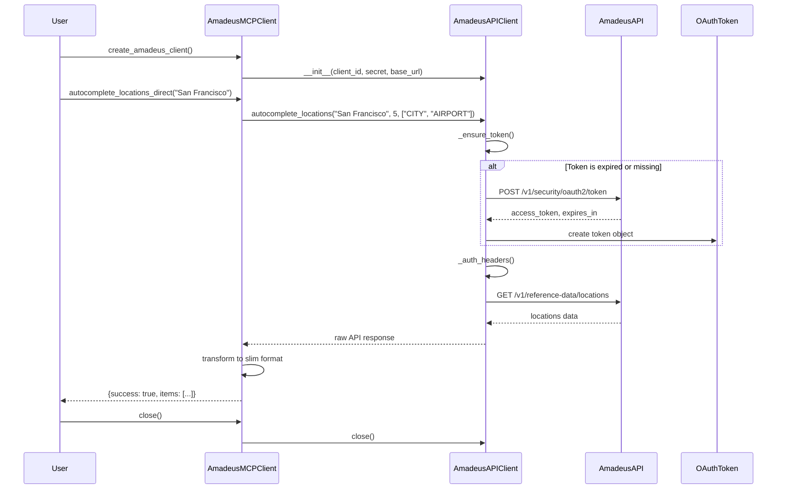
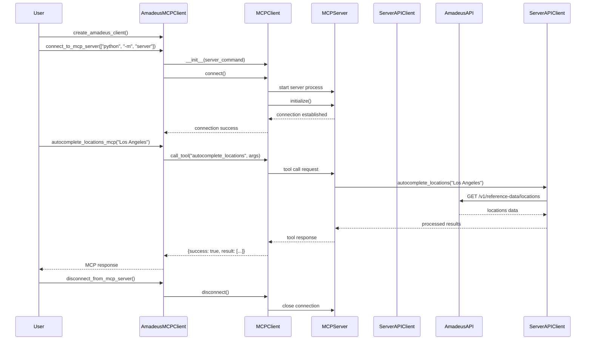
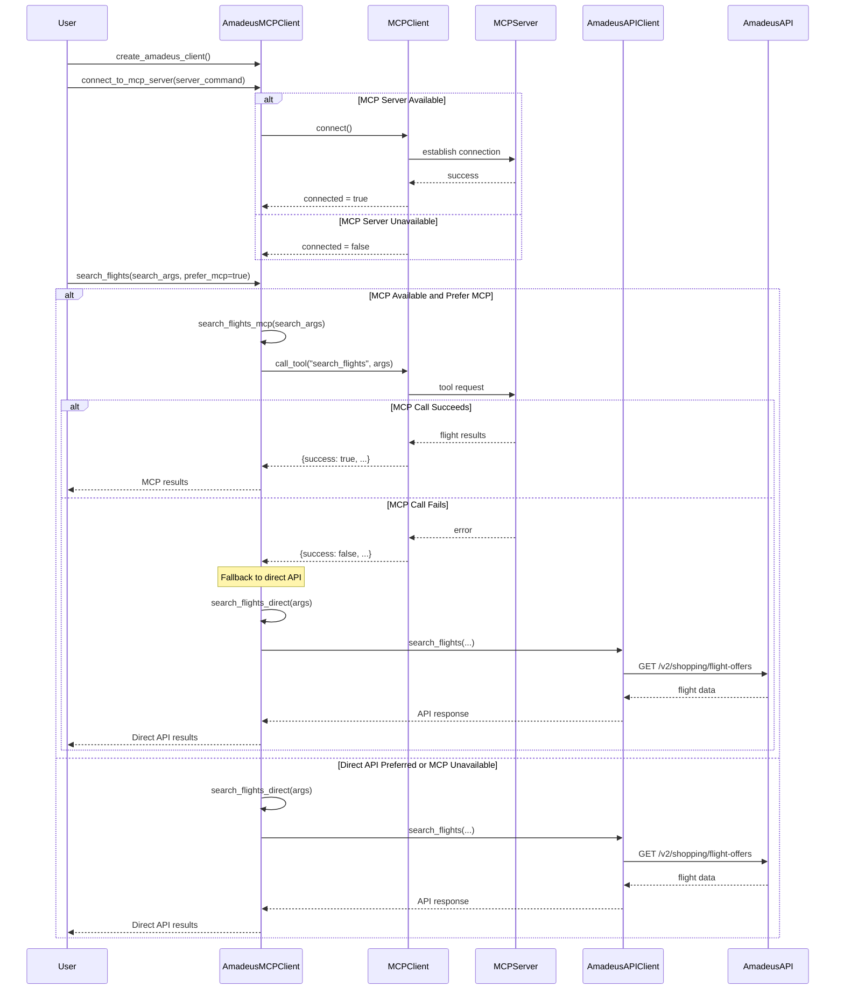
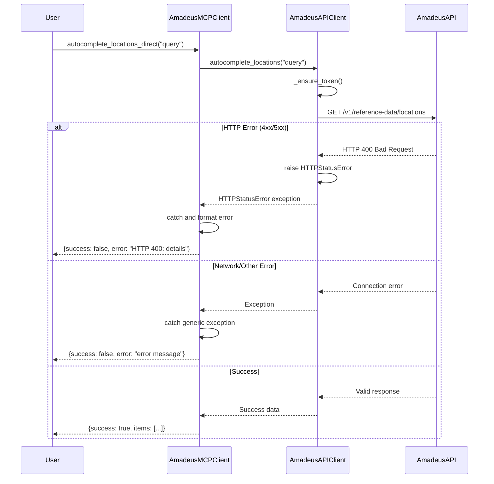

# Amadeus MCP Client Package - Sequence Diagrams

## 1. Direct API Usage Flow

## 2. MCP Server Usage Flow

## 3. Hybrid Usage with Fallback

## 4. Flight Search and Pricing Flow

## 5. Error Handling Flow

## Key Interaction Patterns

### 1. **Authentication Flow**
- OAuth token managed automatically by `AmadeusAPIClient`
- Token refresh handled transparently before API calls
- Credentials loaded from environment variables

### 2. **Dual Access Pattern**
- Direct API methods (`*_direct()`) for immediate access
- MCP methods (`*_mcp()`) for server-mediated access  
- Convenience methods with automatic fallback

### 3. **Error Handling Strategy**
- HTTP errors captured with detailed status information
- MCP failures trigger automatic fallback to direct API
- Consistent error response format across all methods

### 4. **Data Transformation**
- Raw API responses transformed to "slim" format
- Full offer data preserved for pricing operations
- Consistent response structure for client applications

### 5. **Resource Management**
- HTTP client and MCP connections properly closed
- Connection state tracked and validated
- Graceful degradation when services unavailable