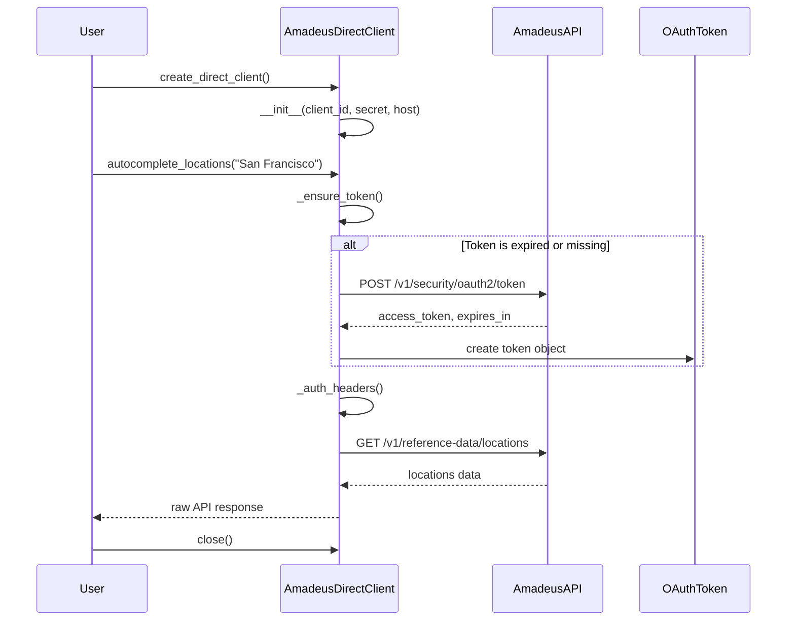
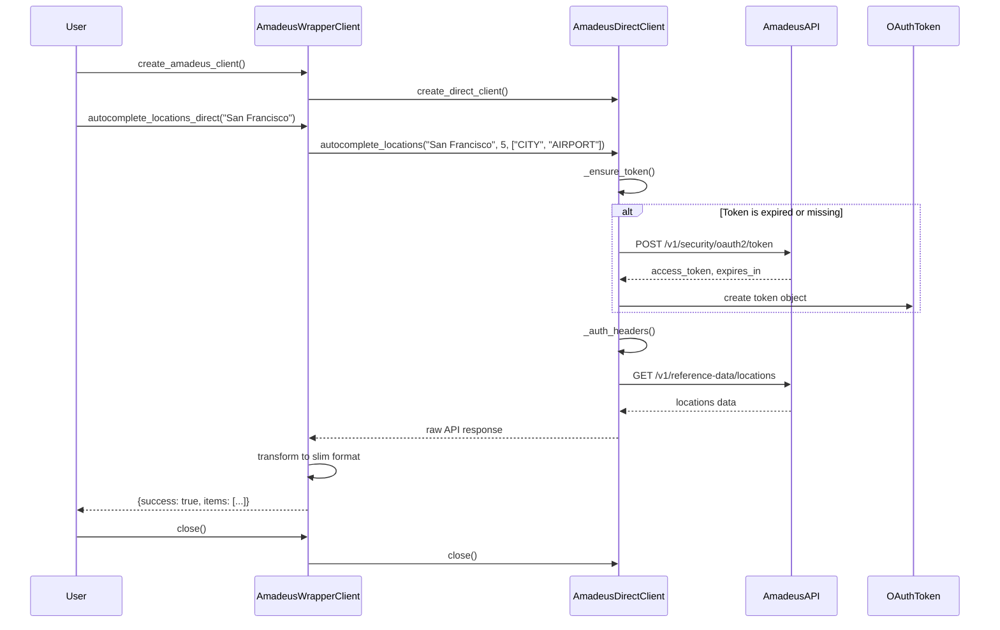
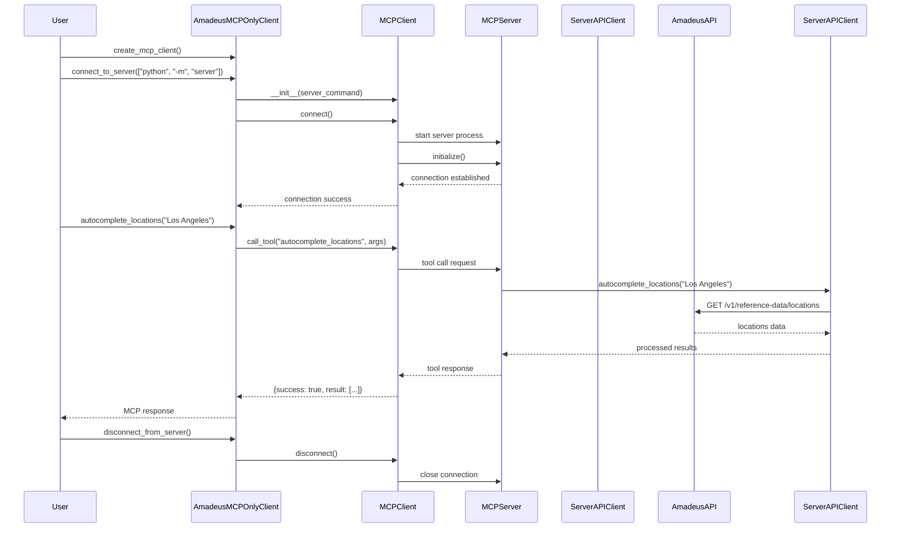
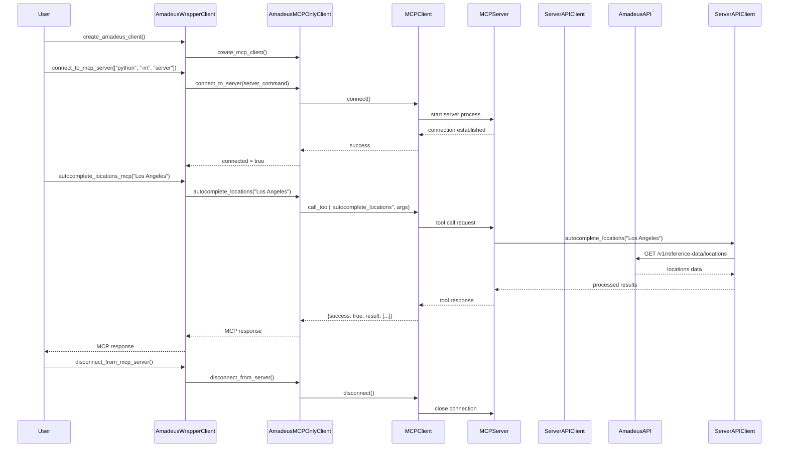
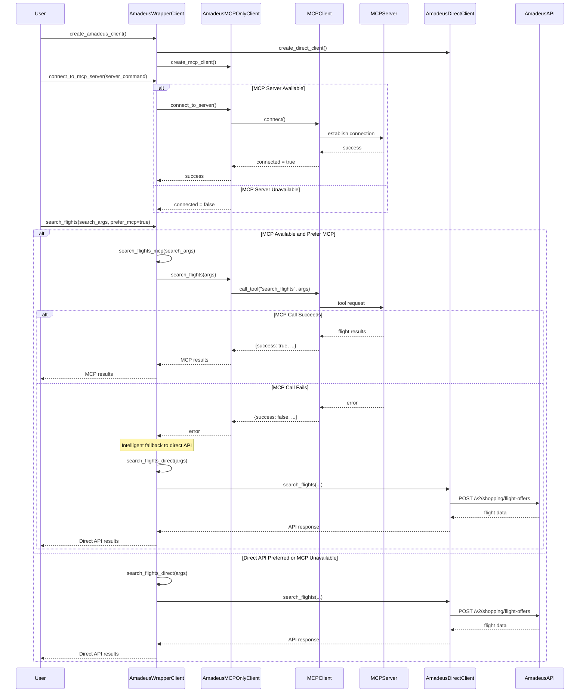
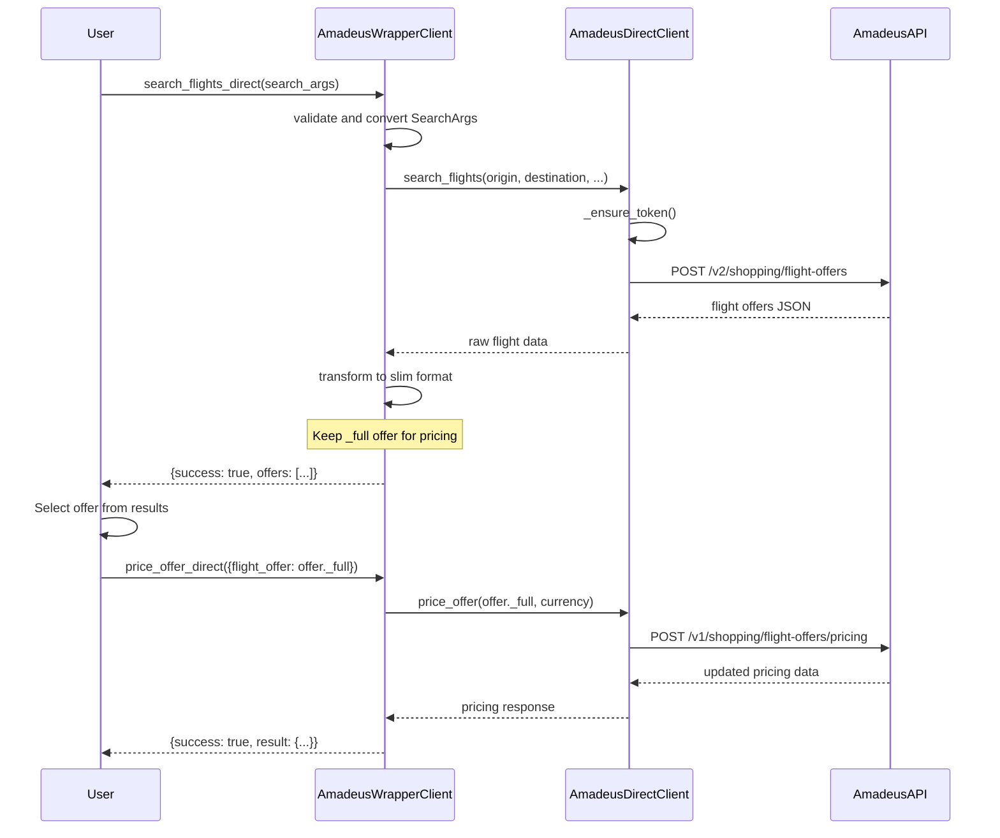
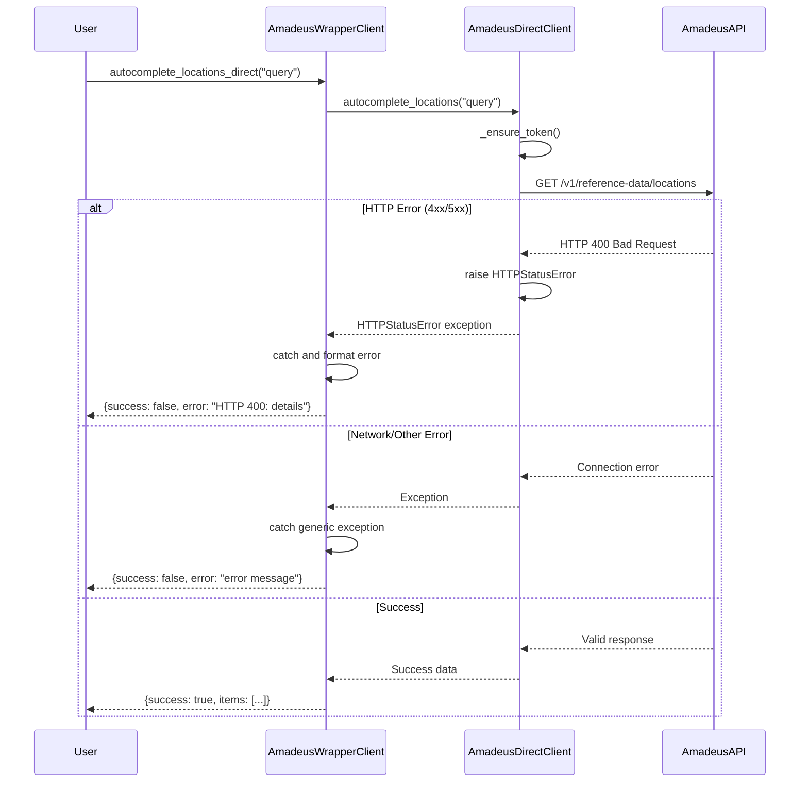

# Amadeus MCP Client Package - Refactored Sequence Diagrams

## 1. Direct API Usage Flow (Using AmadeusDirectClient)

## 1b. Direct API Usage via Wrapper Client

## 2. MCP Server Usage Flow (Using AmadeusMCPOnlyClient)

## 2b. MCP Server Usage via Wrapper Client

## 3. Hybrid Usage with Intelligent Fallback (Wrapper Client)

## 4. Flight Search and Pricing Flow (Updated)

## 5. Error Handling Flow (Updated)

## Key Interaction Patterns in Refactored Architecture

### 1. **Authentication Flow**
- OAuth token managed automatically by `AmadeusDirectClient`
- Token refresh handled transparently before API calls
- Credentials loaded from environment variables
- Isolated in direct client for clear separation of concerns

### 2. **Modular Access Pattern**
- **Direct API**: `AmadeusDirectClient` for immediate low-level access
- **MCP Protocol**: `AmadeusMCPOnlyClient` for server-mediated access  
- **Unified Interface**: `AmadeusWrapperClient` with intelligent fallback logic
- Each component can be used independently

### 3. **Intelligent Fallback Strategy**
- `AmadeusWrapperClient` tries MCP first, automatically falls back to direct API
- HTTP errors captured with detailed status information in both paths
- MCP failures trigger seamless fallback with no user intervention required
- Consistent error response format across all access methods

### 4. **Data Transformation & Response Normalization**
- Raw API responses transformed to "slim" format in wrapper client
- Full offer data preserved for pricing operations
- Direct client returns raw API responses for maximum flexibility
- Wrapper client provides normalized, consistent response structure

### 5. **Resource Management & Connection Handling**
- Each client manages its own resources independently
- HTTP client properly closed in `AmadeusDirectClient`
- MCP connections tracked and validated in `AmadeusMCPOnlyClient`  
- `AmadeusWrapperClient` coordinates cleanup across both clients
- Graceful degradation when services unavailable

### 6. **Separation of Concerns**
- **Authentication**: Isolated in direct client
- **Protocol handling**: Isolated in MCP client  
- **Business logic**: Coordinated in wrapper client
- **Error handling**: Implemented at appropriate layers
- **Resource management**: Handled by respective components

### 7. **Flexible Usage Patterns**
- **Minimalist**: Use `AmadeusDirectClient` for simple API access
- **Protocol-specific**: Use `AmadeusMCPOnlyClient` for MCP operations
- **Comprehensive**: Use `AmadeusWrapperClient` for full functionality with fallback
- **Legacy compatible**: Existing code continues to work unchanged